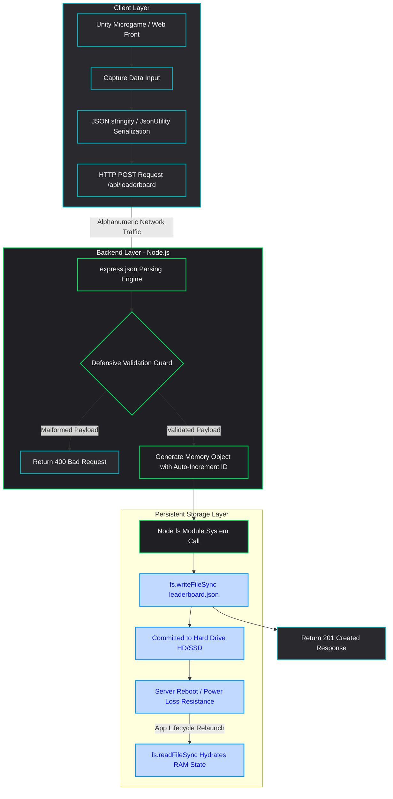

# 🕹️ Full-Stack Game Services Ecosystem: Node.js & Unity Integration

An architectural prototype of **Connected Game Services** that integrates a Unity game engine application with a persistent, non-volatile REST API backend. This project serves as a practical demonstration of low-level data serialization, defensively validated client-server communications, and structured file system storage.

---

## 📊 Architectural & Data Flow Diagram

The flowchart below (rendered natively via Mermaid) illustrates the full life cycle of a score event—from client capture to non-volatile hard drive (HD/SSD) writing.

---

## 🛠️ Tech Stack & Architecture

- **Game Engine Application:** Unity Hub Microgame template operating on the **URP (Universal Render Pipeline)**.
- **Client Scripting:** C# scripts utilizing asynchronous Coroutines (`IEnumerator`) and native `UnityWebRequest` network handlers.
- **Backend API:** Node.js powered by the light-weight Express framework.
- **Security Middleware:** CORS configuration enabling domain isolation overrides for development.
- **Persistent Data Store:** JSON-based local flat-file storage managing data via synchronous File System I/O operations (`fs`).

---

## 🚀 Key Engineering Lessons Learned

1. **Defensive Programming (Never Trust the Client):** Encountered and resolved a `500 Internal Server Error` during the early development stage caused by unvalidated client payloads. Implemented structural payload validation guards returning proper `400 Bad Request` states instead of allowing database execution layers to crash the application stack.
2. **State vs. Cache (Volatile Memory Management):** Transitioned from purely volatile server RAM allocations (`let array = []`) to non-volatile filesystem updates to guarantee data durability over application process lifecycles.
3. **Data Serialization/Deserialization:** Mastered data transport formatting by converting cross-platform binary representations into structured alphanumeric text strings (**JSON** strings) transmitted asynchronously over network protocols.
<a href="http://localhost:3000/">Click aqui para ver o cliente</a>

---

## 🚀 DataFlow Diagram

<<<<<<< HEAD
    
=======
    
>>>>>>> d39aaea3346ed6c29dce5d0ee316b3575f679bd9
